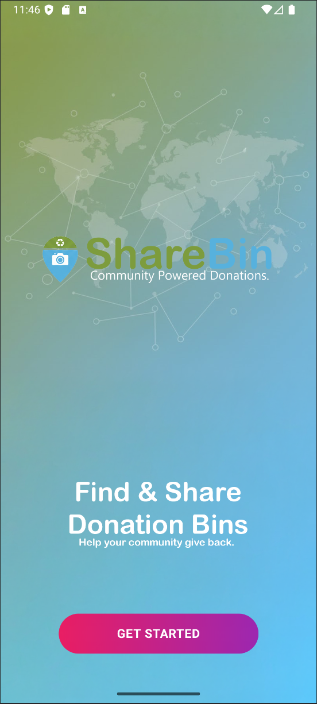
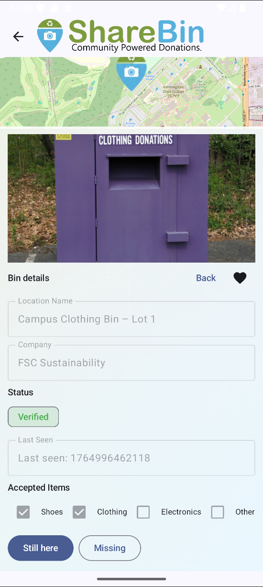
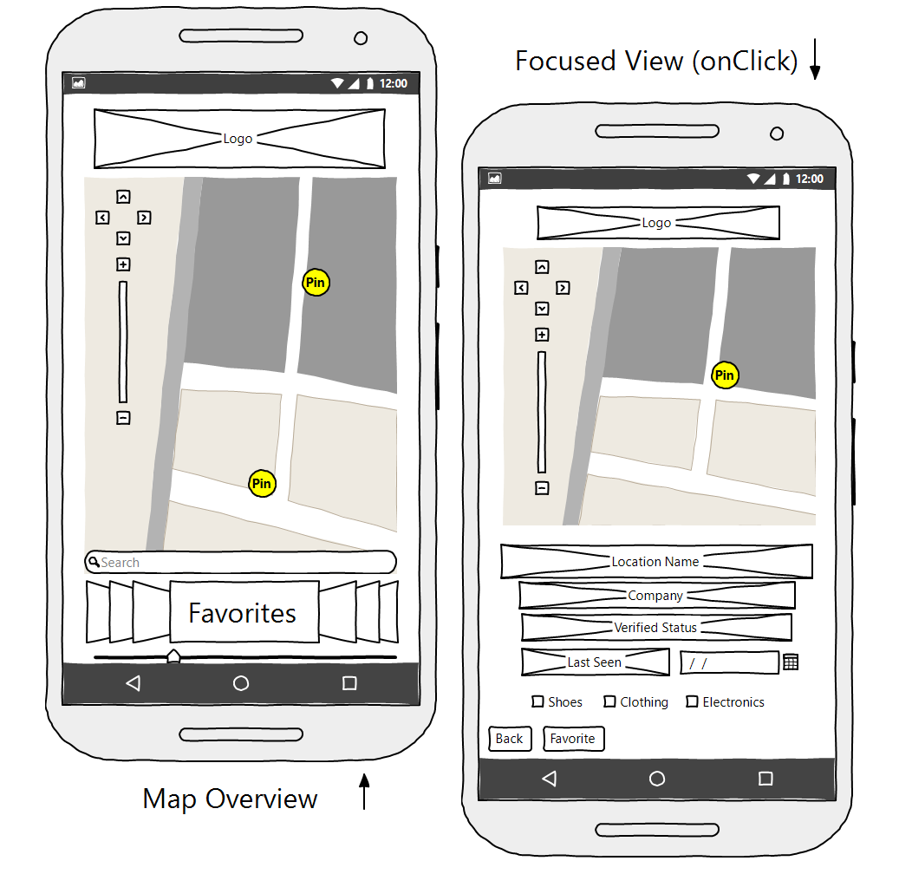
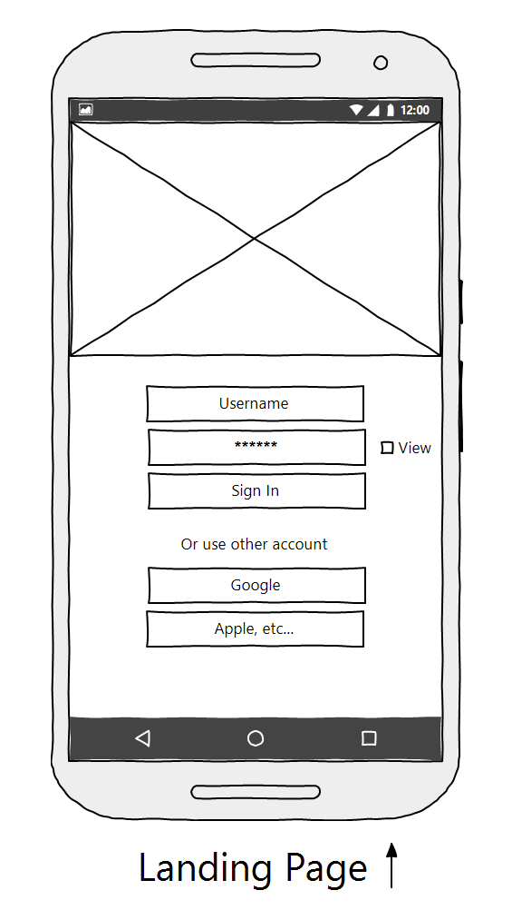

<p align="center">
  
</p>

<p align="center">
  
  
  
  
  
  
  
  
  
</p>

ShareBin is a Kotlin-based Android application built with Jetpack Compose, designed to provide a transparent, community-driven directory of donation and clothing bin locations. The application enables users to browse nearby bins, verify their condition, report missing units, and contribute to a shared, continuously updated ecosystem that supports local organizations while reducing waste.

The platform prioritizes accuracy, accountability, and clarity through a modern Compose UI, real-time map interaction, local Room database persistence, and offline-first functionality. Users can also favorite bins and receive reminders when a location has not been verified for an extended period.

Donation bins are often moved, vandalized, misreported, or abandoned. ShareBin addresses this by empowering the community to maintain an authoritative record through collective verification and transparent status reporting. Fast map rendering, persistent data storage, and a clean user experience make the application both practical and reliable.

This project demonstrates end-to-end Android development using contemporary technologies and patterns (Jetpack Compose, MVVM, Room, OSMDroid, and local notifications), making it well-suited for academic evaluation, community engagement initiatives, and portfolio presentation.


---

## Features

### Core Application Capabilities
- Comprehensive bin directory with photos, operators, and accepted item categories  
- Fully interactive map with custom markers, smooth camera transitions, and bin-focused navigation  
- Detail panels with the latest verification timestamp and contribution history  
- User-driven status reporting (“Still here” or “Missing”)  
- Toggling favorite bins for quick access and tracking  
- Automatic stale-bin detection with local notifications for unverified favorites  

### User Experience
- Zero-friction onboarding through a simple landing page  
- Lightweight local authentication and session persistence  
- Elegant Material 3 UI designed for clarity and accessibility  
- Responsive layouts suitable for phones and large-screen devices  

### Technology Stack
- **Language:** Kotlin  
- **UI Framework:** Jetpack Compose (Material 3)  
- **Architecture:** MVVM + Repository Pattern  
- **Local Storage:** Room Database  
- **Concurrency:** Kotlin Coroutines + StateFlow  
- **Navigation:** Navigation Compose  
- **Maps:** OSMDroid (OpenStreetMap)  
- **Notifications:** NotificationManager + Android 13 permission model  

---

## Screenshots

<p align="center">
  <br>
  <em>Home / Landing Page</em>
</p>

<p align="center">
  <br>
  <em>Bin List Screen</em>
</p>

<p align="center">
  <br>
  <em>Map Overview</em>
</p>

<p align="center">
  <br>
  <em>Bin Detail / Focused View</em>
</p>

---

## Wireframes

<p align="center">
  <br>
  <em>Map Overview & Focused View (Wireframe)</em>
</p>

<p align="center">
  <br>
  <em>Landing / Login Page (Wireframe)</em>
</p>

---

## Architecture

ShareBin follows a modular, scalable MVVM architecture:

- **UI Layer (Jetpack Compose)**  
  Stateless composables with observable state streams and clear presentation logic.  

- **ViewModel Layer**  
  Business logic, input handling, and state transformation using StateFlow.  

- **Repository Layer**  
  Abstracted data access, bridging persistent data with the ViewModel.  

- **Local Persistence (Room)**  
  Offline-first storage of bin metadata, favorites, verification history, and photos.  

- **Map Integration (OSMDroid)**  
  Efficient map tile rendering, marker overlays, and route centering.  

This structure ensures maintainability, testability, and clear separation of concerns.

---

## Project Structure

```
app/
 └─ src/
     └─ main/
         ├─ java/com/example/csc371_sharebin/
         │   ├─ data/          # Repository + local storage
         │   ├─ ui/            # Composable screens & components
         │   ├─ navigation/     # App navigation graph
         │   ├─ viewmodel/      # MVVM ViewModels
         │   └─ MainActivity.kt # App entry point + notification logic
         └─ res/
             ├─ drawable/
             ├─ values/
             └─ mipmap/
```

---

## Installation & Setup

### Requirements
- Android Studio Ladybug (or newer)  
- Kotlin 2.x  
- Gradle-compatible Android SDK  
- minSdkVersion: 26  

### Steps
```
git clone https://github.com/JderenthalCS/ShareBin.git
```

1. Open the project in Android Studio  
2. Allow Gradle sync to complete  
3. Run on an emulator or connected device  

No additional configuration is required.

---

## Usage Guide

### Navigation
The application includes four primary destinations:
- Landing Screen  
- Bin List Screen  
- Map Overview  
- Bin Detail / Verification Panel  

### Updating Bin Status
Open a bin detail panel and select:
- **Still here** to verify a bin is present  
- **Missing** to report a removed or inaccessible bin  

Changes propagate instantly to the local Room database.

### Favorites & Stale-Bin Reminders
Favorited bins are monitored. If a bin has not been verified within 30 days, ShareBin notifies the user upon returning to the app.

---

## Notification System

A dedicated notification channel is created on first launch. The system:
- Runs a stale-check routine on `MainActivity.onResume()`  
- Counts how many favorite bins are outdated  
- Sends a local notification with a quick-access map link  

Works with Android 13+ POST_NOTIFICATIONS permissions.

---

## Future Improvements

This project can be extended with:  
- Cloud synchronization (Firebase or Supabase)  
- Shared verification logs between users  
- Admin/organization dashboard  
- Automatic detection of bin relocations  
- Offline map tile caching  

---

## License

This project is licensed for educational, academic, and portfolio use.  
Commercial use, redistribution, or repackaging requires explicit permission.

---

## Maintainer

**Justin Derenthal**  
GitHub: https://github.com/JderenthalCS  
Portfolio: https://justinderenthal.dev
